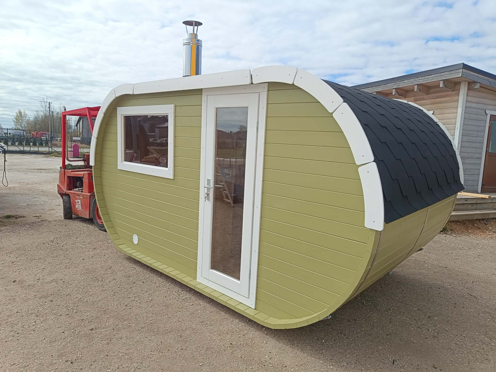

# OutDoorSauna veebileht

See kaust sisaldab valmis HTML/CSS/JS veebilehte.

## Failid

- `index.html` – lehe sisu, tekstid, pildid, nupud ja vorm
- `style.css` – kogu kujundus, värvid, suurused, mobiilivaade
- `script.js` – vaadete vahetamine, keelevahetus ja vormi käitumine
- `assets/` – kõik pildid

## Kuidas teksti muuta?

Ava `index.html` ja otsi soovitud tekst üles.

Kui tekstil on juures näiteks:

```html
data-i18n="hero_title"
```

siis muuda sama teksti ka `script.js` failis `translations` osa sees.

## Kuidas pilti muuta?

Pane uus pilt `assets` kausta ja muuda HTML-is näiteks:

```html

```

uue pildi nimeks.

## Kuidas värve muuta?

Ava `style.css` ja muuda faili alguses `:root` ploki sees olevaid värve.

## Kuidas lisada uus menüü vaade?

Kõige lihtsam on kopeerida üks olemasolev `<section id="...">` plokk `index.html` failis,
anda sellele uus id ja lisada ülemisse menüüsse nupp:

```html
<button onclick="showPage('uusvaade')">Uus vaade</button>
```

## Vorm

Kontaktivorm asub `index.html` faili lõpus. Praegu avab see kasutaja seadmes e-kirja.
Päris veebimajutuses saab hiljem ühendada vormi serveri, Formspree, Netlify Forms või muu lahendusega.
